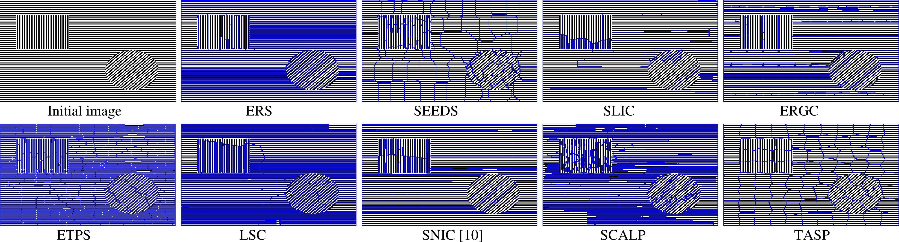

## Texture-Aware Superpixel Segmentation

### Overview

Implementation of paper:  [PDF](https://arxiv.org/abs/1901.11111)
```
@inproceedings{giraud2019tasp,
  title={Texture-Aware Superpixel Segmentation},
  author={Giraud, R{\'e}mi and Ta, Vinh-Thong and Papadakis, Nicolas and Berthoumieu Yannick},
  conference={IEEE International Conference on Image Processing (ICIP 2019)},
  year={2019}
}
```

- TASP superpixels generated using texture-aware patch-based distances 




### Requirements

- Linux

- For C++ version:  [CImg library](http://cimg.eu/)  (unique .h already included)
- 

### Execution

#### MATLAB / C-Mex
```
run main.m    %call TASP_mex
```


#### C++

- Compilation:
```
make
```

- Execution prototype:
```
./TASP -i img_name [-k superpixel_nbr(450)] [-m compactness(0.075)]  [-outm output_map_name(./res/labelmap.png)] [-outb output_border_name(./res/borders.png)]
```
- Execution with contour map:  (make test)
``` 
./TASP -i ./data/texture_compo.png -k 90 -m 0.1 -outm test_img_labelmap.png -outb test_img_border.png
```
- Execution on an image list:  (make test_list)
```
./scripts/test_list.sh ./data/list_file.txt ./data/ 450 0.1
```


### Data

The Berkeley Segmentation Dataset (BSD): containing 500 images of size 321x481 pixels with segmentation and contour ground truths is available 
[here](https://www2.eecs.berkeley.edu/Research/Projects/CS/vision/grouping/resources.html)

CTD: Composite texture dataset: mix-Brodatz: Natural composite texture dataset using images from the Brodatz dataset image
mix-Stripes: Synthetic composite texture dataset combining lines with different orientations
[here] https://github.com/rgiraud/ctd

### License

(C) Rémi Giraud, 2019
remi.giraud@u-bordeaux.fr  
[https://remi-giraud.enseirb-matmeca.fr](https://remi-giraud.enseirb-matmeca.fr)  
ENSEIRB-MATMECA (Bordeaux INP), Laboratory IMS

This code is free to use, share and modify for any non-commercial purposes.
Any commercial use is strictly prohibited without the authors' consent, also including authors from (chen2017) since SCALP uses some part of their code:
```
@InProceedings{chen2017,
    author   = {Jiansheng Chen and Zhengqin Li and Bo Huang},
    title    = {Linear Spectral Clustering Superpixel},
    booktitle  = {IEEE Transactions on Image Processing},
    YEAR   = {2017},
}
```
